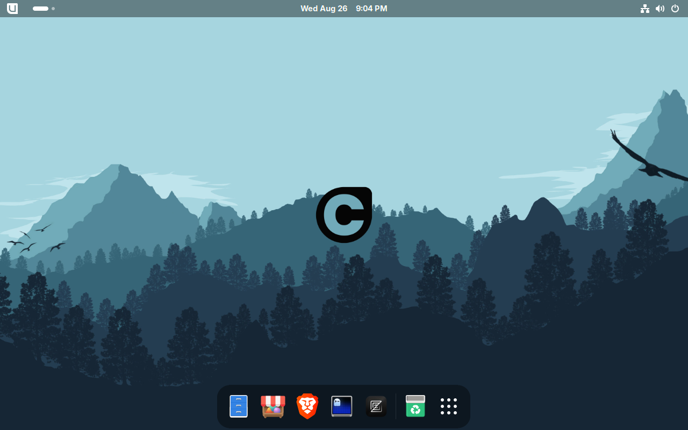

# CalOS


A custom Fedora Atomic desktop built on [Bluefin](https://github.com/ublue-os/bluefin).

> [!WARNING]
> This is a side project and may stop recieving updates at any time.

## Variants

| Tag | Base Image | GPU |
|-----|-----------|-----|
| `:latest` | `ghcr.io/ublue-os/bluefin:stable` | AMD / Intel |
| `:latest-nvidia` | `ghcr.io/ublue-os/bluefin-nvidia-open:stable` | NVIDIA (open drivers) |
| `:vX.Y.Z` / `:vX.Y.Z-nvidia` | released on each `v*` tag | matching variant |

Both container variants are built daily via GitHub Actions and pushed to GHCR. Tagged releases (e.g. `v1.2.0`) also publish versioned container images (`:v1.2.0` / `:v1.2.0-nvidia`) with the release codename baked in. The ISO, QCOW2, and VMDK files are hosted on SourceForge.

# Minimum Requirements
If you do not meet the minimum specs, the operating system may perform poorly and become unstable.

Minimum:
Memory:  6gb of ram
CPU (x86_64):  Intel Core i5-8400 or AMD Ryzen 5 2600 or equivalent 
CPU (ARM64): 4-core Cortex-A72-class or equivalent
Storage:  32gb storage

Recommended:
Memory:  12gb of ram 
CPU (x86_64):  Intel Core i5-10400 or AMD Ryzen 5 3600 or equivalent
CPU (ARM64): 4-core Cortex-A76-class or equivalent
Storage:  48gb storage

Heavy Multitasking or Gaming:
Memory:  16gb of ram 
CPU (x86_64):  Intel Core i5-11400 or AMD Ryzen 5 5600 or equivalent
CPU (ARM64):  6+ core Cortex-A76-class or equivalent
Storage: 64 GB+

# Install

## Download

Releases are indexed on the [GitHub Releases](https://github.com/callenflynn/calos/releases) page, with the actual image files hosted on [SourceForge](https://sourceforge.net/projects/calos-linux/files/). Each release tag (e.g. `v1.2.0`) is published to its own SourceForge folder (`/1.2.0/`) so older releases stay downloadable.

Every minor version has a codename — v1.1 is **CalOS Huron**, v1.2 is **CalOS Superior**, v1.3 is **CalOS Eerie** — shown in the installed system (Settings → About, GRUB, fastfetch) for both the disk images and the `:vX.Y.Z` container images.

- **standard** — AMD / Intel GPUs (recommended)
- **nvidia** — NVIDIA GPUs only


## Bootc
From any bootc-based system (Bluefin, Bazzite, Aurora, Fedora Atomic):

```bash
sudo bootc switch ghcr.io/callenflynn/calos:latest
```

For NVIDIA GPUs:

```bash
sudo bootc switch ghcr.io/callenflynn/calos:latest-nvidia
```

After either switch, update the installed system with:

```bash
sudo bootc update
sudo reboot
```

To pin a specific release instead of the rolling `latest` (replace v1.1.1 with the version you want to use):

```bash
# Standard / AMD / Intel 
sudo bootc switch ghcr.io/callenflynn/calos:v1.1.1

# NVIDIA hardware
sudo bootc switch ghcr.io/callenflynn/calos:v1.1.1-nvidia
```

Reboot to apply. For the rolling channel, `bootc update` checks the selected CalOS `:latest` image and stages updates for the next reboot. Versioned tags such as `:v1.1.1` are pinned and do not move automatically.

## Disk images

Prebuilt qcow2 + vmdk (VMs) and anaconda-iso (USB/installer) images are built daily and published automatically to the [SourceForge project files](https://sourceforge.net/projects/calos-linux/):

- **standard** — AMD / Intel GPUs (qcow2 for QEMU/Boxes, vmdk for VMware, installer ISO)
- **nvidia** — NVIDIA GPUs (qcow2, installer ISO)

Tagged releases (`vX.Y.Z`) are published to versioned SourceForge folders (e.g. `/1.2.0/`) and linked from [GitHub Releases](https://github.com/callenflynn/calos/releases). Use the latest GitHub Release to find the current versioned download links; the docs site does not guess a `/latest/` SourceForge folder. SourceForge generates MD5/SHA1/SHA256 checksums for every file on the files page, so you can verify any download there.

## What's Included

### Preinstalled Apps

| App | Replaces | Notes |
|-----|----------|-------|
| [Zed](https://zed.dev) | VSCode | Primary IDE, GPU-accelerated |
| [Brave](https://brave.com) | Firefox | Privacy-focused browser |
| [Ghostty](https://ghostty.org) | GNOME Terminal | Modern GPU-accelerated terminal |
| [Neovim](https://neovim.io) + [LazyVim](https://www.lazyvim.org) | — | Terminal IDE, pre-configured for all users |
| [lazygit](https://github.com/jesseduffield/lazygit) | — | Git TUI |
| [Starship](https://starship.rs) | — | Shell prompt with CalOS branding |
| [tmux](https://github.com/tmux/tmux) | — | Terminal multiplexer |
| [fastfetch](https://github.com/fastfetch-cli/fastfetch) | — | System info with CalOS ASCII art |

### Developer Tools

- **Neovim + LazyVim** — Preloaded starter config, first launch installs all plugins automatically
- **lazygit** — Terminal Git interface
- **ripgrep, fd-find** — Fast search tools
- **gcc, gcc-c++, make** — Build toolchain
- **unzip** — Archive extraction

# Screenshots

v1.1.0 desktop




# Branding

## Colors
| Role | Hex |
|------|-----|
| Primary accent | `#FF3B00` |
| Background | `#050505` |
| Background 2 | `#ffeee9` |
| Text | `#E0E0E0` |
| Text 2 | `#050505` |

## Logos

primary logo


B&W


