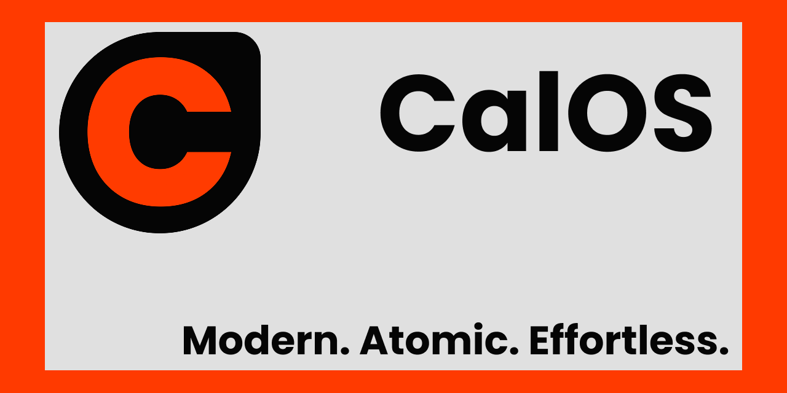

# CalOS


A custom Fedora Atomic desktop built on [Bluefin](https://github.com/ublue-os/bluefin).

> [!WARNING]
> This is a side project and may stop recieving updates at any time.

## Variants

| Tag | Base Image | GPU |
|-----|-----------|-----|
| `:latest` | `ghcr.io/ublue-os/bluefin:stable` | AMD / Intel |
| `:latest-nvidia` | `ghcr.io/ublue-os/bluefin-nvidia-open:stable` | NVIDIA (open drivers) |

Both variants are built daily via GitHub Actions and pushed to Sourceforge.

# Install

## Download

Download the Qwoc2 or ISO files from [Sourceforge](https://sourceforge.net/projects/calos-linux/)


## Bootc
From any bootc-based system (Bluefin, Bazzite, Aurora, Fedora Atomic):

```bash
sudo bootc switch ghcr.io/callenflynn/calos:latest
```

For NVIDIA GPUs:

```bash
sudo bootc switch ghcr.io/callenflynn/calos:latest-nvidia
```

Reboot to apply. Updates are automatic — `bootc` checks for new images in the background and stages them for the next reboot.

## Disk images

Prebuilt qcow2 + vmdk (VMs) and anaconda-iso (USB/installer) images are built daily and published automatically to the [SourceForge project files](https://sourceforge.net/projects/calos-linux/):

- **standard** — AMD / Intel GPUs (qcow2 for QEMU/Boxes, vmdk for VMware, installer ISO)
- **nvidia** — NVIDIA GPUs (qcow2, installer ISO)

SourceForge generates MD5/SHA1/SHA256 checksums for every file on the files page, so you can verify any download there.

## What's Included

### Preinstalled Apps

| App | Replaces | Notes |
|-----|----------|-------|
| [Zed](https://zed.dev) | VSCode | Primary IDE, GPU-accelerated |
| [Brave](https://brave.com) | Firefox | Privacy-focused browser |
| [Ghostty](https://ghostty.org) | GNOME Terminal | Modern GPU-accelerated terminal |
| [Neovim](https://neovim.io) + [LazyVim](https://www.lazyvim.org) | — | Terminal IDE, pre-configured for all users |
| [lazygit](https://github.com/jesseduffield/lazygit) | — | Git TUI |
| [Starship](https://starship.rs) | — | Shell prompt with CalOS branding |
| [tmux](https://github.com/tmux/tmux) | — | Terminal multiplexer |
| [fastfetch](https://github.com/fastfetch-cli/fastfetch) | — | System info with CalOS ASCII art |

### Developer Tools

- **Neovim + LazyVim** — Preloaded starter config, first launch installs all plugins automatically
- **lazygit** — Terminal Git interface
- **ripgrep, fd-find** — Fast search tools
- **gcc, gcc-c++, make** — Build toolchain
- **unzip** — Archive extraction


## Colors

| Role | Hex |
|------|-----|
| Primary accent | `#FF3B00` |
| Background | `#050505` |
| Text | `#E0E0E0` |
